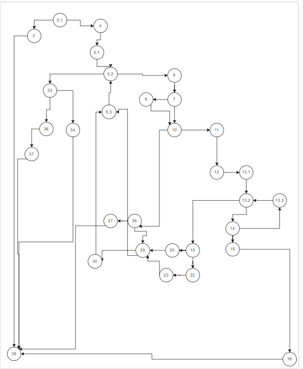

# Втора лабораториска вежба по Софтверско инженерство
Тео Ефтимов бр.индекс 222137

Control Graph Flow

Цикломатската комплексност

Комплексноста ја добив со користење на формулата
број на ребра - број на јазли + 2
односно:
38-31+2=9

Цикломатската комплексност=9

